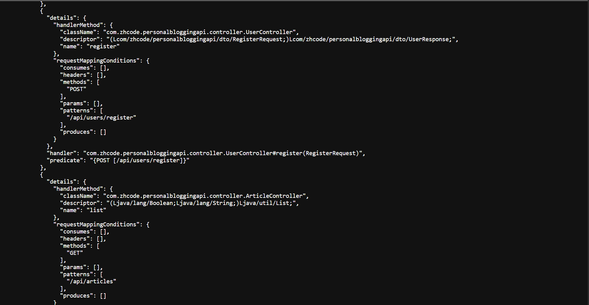

<h1 align="center">Personal Blogging API ✍🏼</h1>

## About:
Personal Blogging API is a lightweight RESTful backend powering a simple personal blogging platform. 
It includes a full CRUD for articles with ownership enforcement. The whole stack is dockerised and runs with `docker compose up`. 

## Technology and Tools:
[](https://www.oracle.com/java/)
[](https://spring.io/projects/spring-boot)
[](https://maven.apache.org/)
[](https://www.postgresql.org/)
[](https://www.docker.com/)

## Gallery:
<p align="left">
  
</p>

## Running the Application:
### Prerequisites:
Make sure you have the following installed:
- Docker Desktop (includes Docker Compose)
- Git

### Setup Instructions:
```bash
# 1) Clone the repo
git clone https://github.com/27July/personal-blogging-api.git
cd personal-blogging-api

# 2) Create your environment file
cp .env.local .env

# 3) Start the API + Postgres
docker compose up --build
```

## Features:
- User registration + login (basic token auth, NOT SECURE)
- Create articles (requires auth)
- List articles (supports filtering by current user)
- Get article by ID
- Update/Delete articles with ownership enforcement
- Clean error handling with proper HTTP statuses (400/401/403/404/409)

## API endpoints:
- POST /api/users/register
- POST /api/users/login
- POST /api/articles (requires Token)
- GET /api/articles
- GET /api/articles?mine=true (requires Token)
- GET /api/articles/{id}
- PUT /api/articles/{id} (requires Token, author only)
- DELETE /api/articles/{id} (requires Token, author-only)

## Made with ❤️ by [Wee Zi Hao](https://github.com/27July)
[](https://github.com/27July)
[](https://www.linkedin.com/in/wee-zi-hao)
[](mailto:weezihao@gmail.com)
[](https://27july.github.io/)

